# OpenCyto: How to use different auto gating functions
Mike Jiang  


Here we will illustrate how to choose and use the appropriate gating methods that are pre-registered in `openCyto` package. And users can always define their own `gating` algorithms and register them as the `plugin` functions in `openCyto` framework, see `?registerPlugins` for more details.

Note that all the function names illustrated below are prefixed with `.` indicating that they are simply the wrapper function registered in `openCyto`. The actual `gating engine` behind the wrapper can come from other packages (e.g. `flowCore`, `flowClust`). 
All these wrappers have these common interfaces:
* `fr`: a `flowFrame` object
* `pp_res`: an optional `pre-preocessing` result, which can be ignored in this document
* `channels`: channel names used for gating
* `...`: any other gating parameters pass on to the actual gating engine


```r
library(openCyto)
library(ggcyto)

gs <- load_gs(system.file("extdata/gs_bcell_auto", package = "flowWorkspaceData"))
```
## 1D gating methods
### `mindensity`
The name of this gating function is self-explaining, that is to find the minimum as the cutpoint between negative and postive peaks in 1d density plot. It is fast,robust and extremely easy to use especially when there is a good separation between `+` and `-` populations/peaks.

For example, it is usually easy to gate on `CD3` channel and no need to supply any arguments to the method.


```r
fr <- getData(gs[[2]], "Live")
chnl <- "CD3"
g <- openCyto:::.mindensity(fr, channels = chnl)
autoplot(fr, chnl) + geom_gate(g)
autoplot(fr, chnl, "SSC-A") + geom_gate(g)
```

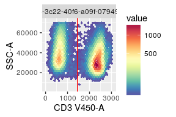

However, it may need some guidance when there are more than `2` major peaks/populations detected in densit profile.

```r
fr <- getData(gs[[1]], "boundary")
chnl <- "FSC-A"
g <- openCyto:::.mindensity(fr, channels = chnl)
mylimits <- ggcyto_par_set(limits = "instrument")
p <- autoplot(fr, chnl) + mylimits
p + geom_gate(g)
autoplot(fr, chnl, "SSC-A") + geom_gate(g)
```

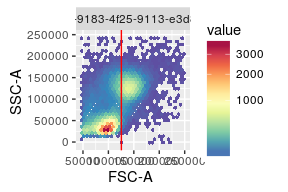

Here we actually want to remove the `debris cells` that are represented by the first negative peak. But `mindensity` cuts between the second and third peaks since they are more predorminant. So we can simply specify a `range` that will limit the locations where the cut point should be placed. 

```r
g <- openCyto:::.mindensity(fr, channels = chnl, gate_range=c(7e4,1e5), adjust = 1.5)
p + geom_gate(g)
autoplot(fr, chnl, "SSC-A") + geom_gate(g)
```


And as shown, we also changed the `kernal density`  smoothing factor `adjust` from  `2`(default value set in `openCtyo`) to `1.5` to avoid over-smoothing.

Alternatively you can achieve the same effect by setting `min` or `max` to pre-filter the data before the `mindenstiy` works on it.

```r
g <- openCyto:::.mindensity(fr, channels = chnl, min = 7e4, max = 1e5)
p + geom_gate(g)
```

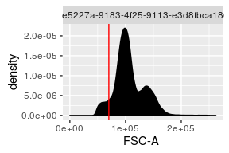

To choose one way or the other or combining both is highly dependent on how your data. The more contrains will give you more controls on how gating proceeds yet at cost of robustness of your gating pipeline sometime.


### `tailgate`
This gating method is used in the senarios where there is only one major peak detected thus automatically disqualify the usage of `mindensity`. `tol` is to control how far the cut point should be placed away from the peak. 


```r
fr <- getData(gs[[1]], "lymph")
chnl <- "Live"
g <- openCyto:::.tailgate(fr, channels = chnl, tol = 0.05)
p <- autoplot(fr, chnl) + mylimits
p + geom_gate(g)
autoplot(fr, chnl, "SSC-A") + geom_gate(g)
```

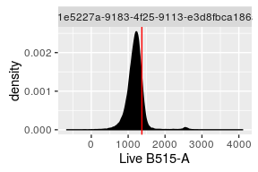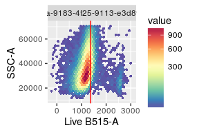

### `quantileGate`
This method is an alternative to `tailgate` and it determines the cutpoint by the events quantile.

```r
g <- openCyto:::.quantileGate(fr, channels = chnl, probs = 0.99)
p <- autoplot(fr, chnl) + mylimits
p + geom_gate(g)
autoplot(fr, chnl, "SSC-A") + geom_gate(g)
```

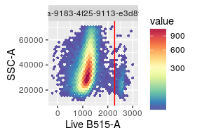

This gating method is more commonly used in gating the `rare` populations when the target population is not prominent enough to stand out as the second peak. (e.g. `cytokine` gates in `ICS` assays.)

## 2D gating methods
### `boundary Gate`
It essentially constructs a rectangle gate from input range (min, max), which is useful for filtering out very extreme signals at the bounary.


```r
fr <- getData(gs[[1]], "root")
chnl <- c("FSC-A", "SSC-A")
g <- openCyto:::.boundary(fr, channels = chnl, min = c(0, 0), max=c(2.5e5,2.5e5))
p <- autoplot(fr, x = chnl[1], y = chnl[2])
p + geom_gate(g)
```

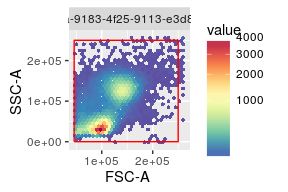

### `singletGate`
Use the `area` vs `height` to gate out the singlets. See details from `?singletGate`.

```r
fr <- read.FCS(system.file("extdata/CytoTrol_CytoTrol_1.fcs", package = "flowWorkspaceData"))
chnl <- c("FSC-A", "FSC-H")
g <- openCyto:::.singletGate(fr, channels = chnl)
p <- autoplot(fr, x = chnl[1], y = chnl[2])
p + geom_gate(g)
```

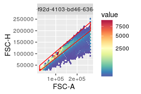

### `flowClust.2d`
`flowClust` package in itself is not limited to 2-dimensional gating. But here we are talking about a dedicated wrapper function `.flowClust.2d` from `openCyto` package that leverages `flowClust` clustering engine to work on `2D` cases specifically. You won't need to write the full name of the function in `csv` gating template, simply put `flowClust` in the `gating_method` column, and then the template parser will automatically dispatch to the right function.


```r
fr <- getData(gs[[1]], "nonDebris")
chnl <- c("FSC-A", "SSC-A")
g <- openCyto:::.flowClust.2d(fr, channels = chnl, K=2, target=c(1e5,5e4), quantile=0.95)
p <- autoplot(fr, x = chnl[1], y = chnl[2]) + mylimits
p + geom_gate(g)
```

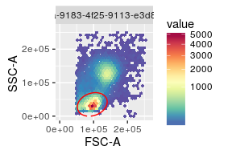

`K` is to tell the algorithm how many major clusters/populations are expected in the 2d profile. `target` specify the mean/center of the target population to get, which doesn't have to be precise. If not supplied, flowClust will pick the most prominent cluster as the target, which would be the right choice in most cases.
`quantile` specify how large the `ellipse` should be. `pp_res` is used to provide the `prior` information for `flowClust`. (More details are in `?flowClust`)


### `Transitional gate`
`flowClust.2d` can optionally construct a `Transitional gate`, which is a speical kind of polygon gate with one edge placed diagonally that is often seen in `flowJo`. Here is an example:

```r
fr <- getData(gs[[1]], "CD19andCD20")
chnl <- c("CD38", "CD24")
g <- openCyto:::.flowClust.2d(fr, channels = chnl, K=6,transitional=TRUE,target=c(3.5e3,3.5e3), quantile=0.95,translation=0.15, pp_res = NULL)
p <- autoplot(fr, x = chnl[1], y = chnl[2]) + mylimits
p + geom_gate(g)
```

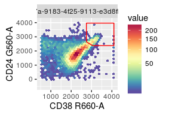

The rational behind the algorithm is beyond the scope of this document. Please see its detailed explainations in `?flowClust.2d`.

### `quadGate.tmix`
This gating method identifies two quadrants (first, and third quadrants) by fitting the data with tmixture model.
It is particually useful when the two markers are not well resolved thus the regular quadGate method
that is based on `1d` gating will not find the perfect cut points on both dimensions.

```r
gs <- load_gs(system.file("extdata/gs_DC_auto", package = "flowWorkspaceData"))
fr <- getData(gs[[2]], "HLADR+")
chnl <- c("CD11c", "CD123")
p <- autoplot(fr, chnl[1], chnl[2])
g <- openCyto:::.quadGate.tmix(fr, channels = chnl, K = 3, usePrior = "no")
p + geom_gate(g)
```

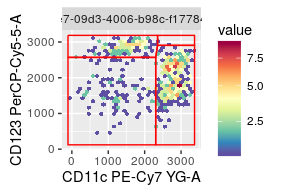

